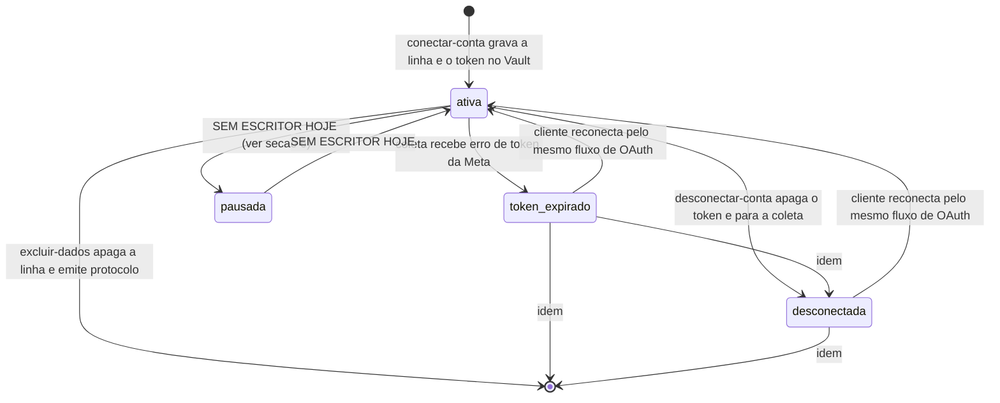

# Módulo conexão — o ciclo de vida da conta conectada

> Sem conta conectada não existe insight, para ninguém. Este documento decide o
> que precisa ser verdade antes do clique, o que cada estado da conta permite e
> o que acontece quando a autorização acaba.
> Fontes: ADR-002, ADR-004, `supabase/schema.sql`, `src/lib/conexaoMeta.js`,
> `supabase/functions/conectar-conta/`, `supabase/functions/excluir-dados/`,
> `memory/restrictions.md`. Última revisão: 2026-09-05.

---

## 1. As pré-condições, ditas ANTES do clique

O produto adotou a variante **Instagram API with Facebook Login** (ADR-002).
Ela cobra um preço de onboarding, e esse preço é fricção real:

```
PARA a conexao ser possivel:
  conta do Instagram e profissional (Business ou Creator)   -- exigido pela Meta
  E conta esta vinculada a uma Pagina do Facebook            -- exigido pela variante
  E quem autoriza administra essa Pagina
  E o usuario esta autenticado no Kora Insights
  E o usuario pertence a exatamente um tenant, ou escolheu um
```

**A tela `/conectar` é obrigada a explicar o requisito da Página antes do
clique**, com passo a passo (ADR-002, "Consequências"). Isso não é gentileza de
UX: mandar o cliente para o diálogo da Meta e deixá-lo descobrir a exigência lá
dentro é prevenir zero erros e exibir um depois — o inverso da regra
"prevenção de erro > mensagem de erro" do CLAUDE.md.

Na Fase 0 vale um teto extra e não negociável: o app está em **Development
mode**, e só operam contas adicionadas manualmente como testers no painel Meta,
na ordem de algumas dezenas (`memory/restrictions.md`). Conta fora dessa lista
não conecta, por mais correto que esteja o fluxo.

### Permissões pedidas, e nenhuma a mais

`instagram_basic`, `instagram_manage_insights`, `pages_show_list`,
`pages_read_engagement` — congeladas em `PERMISSOES`, em
`src/lib/conexaoMeta.js`, e comparadas caractere a caractere em teste.

Não pedimos `instagram_content_publish` nem `instagram_manage_comments`: não há
tela que as justifique, e permissão sem tela correspondente é causa clássica de
reprovação no App Review. Cada permissão é ligada à tela que a usa em
`docs/07_APIS/graph-api.md`.

---

## 2. Os estados, e o que cada um permite

Estados de `ig_contas.status`, fechados por `check` no schema:



| Estado | Coleta roda? | Diagnóstico é gerado? | Token no Vault? | A tela mostra |
|---|---|---|---|---|
| `ativa` | sim | sim | sim | diagnóstico normal |
| `pausada` | **não** | sim | sim | histórico + lacuna crescente |
| `token_expirado` | **não** | sim | referência existe, segredo pode não | pedido de reconexão + lacuna nomeada |
| `desconectada` | não | **não** | não | histórico congelado, com a data do último diagnóstico e o convite a reconectar |
| linha apagada | — | — | não | a conta some; sobra o protocolo em `exclusoes_de_dados` |

Regra que amarra a tabela inteira:

```
-- coleta-diaria
contas = SELECT ... FROM ig_contas WHERE status = 'ativa'

-- gerar-diagnostico
contas = SELECT ... FROM ig_contas WHERE status IN ('ativa','pausada','token_expirado')
```

**Conta com token vencido continua sendo diagnosticada de propósito.** O
histórico dela não some porque a coleta parou; o que precisa aparecer é a
lacuna, não uma tela vazia (ADR-004).

**Conta desconectada não é, e isso também é de propósito.** O histórico dela está
congelado, então refazer o diagnóstico faria uma de duas coisas, as duas ruins:
reescreveria o mesmo veredito com a data de hoje — e uma conta parada apareceria
como recém-lida —, ou, quando a janela rolasse, trocaria o último veredito válido
por "ainda não dá para saber". O último diagnóstico real fica de pé, com a data em
que foi gerado.

Isso obriga a tela a distinguir dois silêncios que se parecem: o diagnóstico que
parou de ser refeito **por falha nossa** e o que parou **porque o cliente
desconectou a conta**. A frase é diferente em cada caso, e assumir a culpa no
segundo mandaria o cliente procurar defeito onde não há
(`modulo-diagnostico.md`, 6.6).

---

## 3. Conectar

```
1. urlDeConsentimento():
     exige VITE_META_APP_ID e VITE_META_OAUTH_URL no ambiente
     gera estado = 128 bits de crypto.getRandomValues, em hexadecimal
     guarda estado em sessionStorage
     devolve a URL do dialogo com scope = as 4 permissoes do ADR-002

2. O usuario autoriza na Meta e volta em /conectar/retorno com code e state.

3. concluirConexao(code, state):
     SE formato de code ou state invalido            -> ENTRADA_INVALIDA
     estado guardado e CONSUMIDO aqui (uso unico)
     SE estado guardado <> state recebido            -> ENTRADA_INVALIDA
     envia code + redirect_uri para a Edge Function conectar-conta

4. conectar-conta (servidor):
     SE nao ha sessao valida                          -> SEM_SESSAO
     SE redirect_uri nao esta em KORA_REDIRECIONAMENTOS_PERMITIDOS
                                                      -> ENTRADA_INVALIDA
     SE o usuario nao pertence ao tenant pedido       -> SEM_PERMISSAO
     SE o usuario tem varios tenants e nao escolheu   -> SEM_PERMISSAO
     troca code por token curto, e token curto por token longo (~60 dias)
     descobre a conta profissional em /me/accounts
     SE nenhuma Pagina administrada tem conta vinculada -> ENTRADA_INVALIDA
     SE a conta ja existe em OUTRO tenant             -> SEM_PERMISSAO
     grava o token no Vault e a REFERENCIA em ig_contas.token_ref
     devolve a conta, sem token_ref
```

Cinco decisões que parecem detalhe técnico e são regra de negócio:

1. **O estado do OAuth é de uso único.** Sem ele, um terceiro monta um retorno
   com o `code` da conta *dele* e induz o cliente a clicar: o navegador do
   cliente chega ao nosso callback já autenticado, e a conta do atacante fica
   vinculada ao tenant da vítima — que passa a ver diagnóstico de um perfil que
   não é o seu.
2. **A `redirect_uri` é conferida contra lista do ambiente.** Sem isso, o
   servidor assinaria a troca do código apontando para o endereço que o atacante
   escolhesse.
3. **A mesma conta do Instagram não muda de tenant.** Um `upsert` por
   `ig_user_id` sem essa checagem moveria a conta — e o histórico inteiro dela —
   para quem conectasse por último.
4. **O token vai ao cofre antes da linha existir.** Linha apontando para
   referência vazia produziria uma conta "conectada" que nunca coleta.
5. **Tenant ambíguo não é resolvido por conta própria.** Escolher entre vários
   conectaria a conta do cliente no espaço de trabalho errado, e desfazer isso
   custa suporte.

Em modo de demonstração, conectar, desconectar e excluir **falham de propósito**
com uma mensagem que diz que nada real acontece ali (ADR-007).

---

## 4. Token vencendo — renovação automática, aviso como último recurso

A Meta entrega token de longa duração de aproximadamente 60 dias, e
`ig_contas.token_expira_em` guarda a data. **ADR-009** decidiu o que fazer com
ela, e são dois prazos diferentes de propósito:

```
-- src/token/validade.js: as duas pontas leem daqui
DIAS_PARA_RENOVAR = 15   -- a coleta troca o token sozinha
DIAS_PARA_AVISAR  =  7   -- a tela pede reconexão

-- derivado, nunca persistido
diasAteVencer = piso((token_expira_em - agora) / 1 dia)
vencido   = status = 'token_expirado' OU diasAteVencer < 0
vencendo  = NAO vencido E diasAteVencer <= DIAS_PARA_AVISAR
```

**A renovação.** Todo dia, antes de coletar, `coleta-diaria` verifica o prazo da
conta. Faltando 15 dias ou menos, ela refaz a troca `fb_exchange_token` — a Meta
aceita um token longo ainda válido como entrada — grava o token novo no cofre com
o mesmo nome (o que preserva `token_ref`) e atualiza `token_expira_em`. O cliente
não é interrompido: não há diálogo de consentimento nesse caminho.

Renovar cedo não desperdiça dia: o prazo novo conta a partir da troca, e não se
soma ao que sobrava.

**A falha da renovação não é falha de coleta.** O token de hoje continua válido
— é para isso que serve a folga de 15 dias — então a coleta do dia segue com ele
e a falha vai só para o log (`coleta.token_nao_renovado`). Ela **não** vira linha
em `coleta_eventos`: aquela tabela alimenta `montarHistorico`, e um evento ali
desenharia lacuna na tela num dia que tem dado.

**O aviso.** Sete dias é menos que os quinze da renovação, e essa distância é a
regra: com a troca automática funcionando, o aviso nunca aparece. Se apareceu, é
porque a renovação já teve mais de uma semana de tentativas e não deu conta —
permissão revogada no painel da Meta, senha trocada, app suspenso. A faixa mora
em `Casca`, vale em toda tela e varre **todas** as contas do tenant: conta perde
dia de histórico esteja ou não em foco.

Conta `desconectada` não gera aviso — foi o cliente que desligou. Conta `pausada`
gera, porque a pausa é temporária e o token vencido a torna definitiva.

---

## 5. Token expirado

```
QUANDO a Graph API recusa com codigo de token invalido (190, 102, 463, 467):
  coleta-diaria grava coleta_eventos(status = 'token_expirado', detalhe)
  SE conta.status <> 'token_expirado' ENTAO conta.status = 'token_expirado'
  a conta sai do loop de coleta dos proximos dias
  montarHistorico transforma o evento em lacuna nomeada
  a tela pede reconexao
```

Tirar a conta do loop não é desistência: cada tentativa gasta orçamento de
chamadas das contas que ainda funcionam, e a tela já tem o que dizer ao cliente.

A reconexão usa **o mesmo fluxo da seção 3**. `conectar-conta` detecta a linha
existente, atualiza o token no cofre e devolve o status a `ativa`. O histórico
já coletado permanece — reconectar não recomeça nada.

---

## 6. Pausada — estado modelado sem escritor

`pausada` existe no `check` do schema e é lida por `gerar-diagnostico`, mas
**nenhum código do produto grava esse status hoje**. Ele foi modelado para o
caso "assinatura suspensa, histórico preservado, coleta parada"
(`docs/03_REGRAS_DE_NEGOCIO/modulo-assinatura.md`, seção 4), que também não está
decidido.

Estado sem escritor não é bug, é intenção pendente — mas precisa estar escrito,
senão vira mistério na primeira leitura do schema.

---

## 7. Desconectar

Desconectar é **diferente** de excluir:

| | Desconectar | Excluir |
|---|---|---|
| Token no Vault | apagado | apagado |
| Coleta | para | para |
| Histórico já coletado | **preservado** | apagado |
| Diagnósticos | preservados | apagados |
| Linha em `ig_contas` | mantida, com `status = 'desconectada'` | apagada |
| Comprovante | nenhum | protocolo em `exclusoes_de_dados` |

A função `desconectar-conta` existe, e a tela `/dados` oferece as duas saídas
lado a lado — a reversível primeiro. Oferecer só a exclusão era um defeito de
produto: quem queria apenas parar a coleta precisava apagar meses de histórico
para conseguir.

**A ordem é regra:** `status = 'desconectada'` antes de `apagar_token`. A coleta
só varre `ativa`, então o status é o que de fato para a coleta; apagar o token
primeiro e falhar no passo seguinte deixaria a conta na fila da madrugada sem
token, falhando com "token expirado" — e a tela pediria reconexão a quem acabou
de pedir desconexão.

`token_ref` continua apontando para o segredo apagado: a coluna é `not null`,
conta desconectada não é varrida, e reconectar reescreve a referência. O que
importa é o segredo ter saído do cofre.

Desconectar de novo devolve sucesso com `jaEstava: true`, não erro: quem clicou
duas vezes quer o mesmo estado final, e erro ali ensinaria o cliente a duvidar de
uma operação que deu certo.

Apagar o segredo do Vault é operação de `service_role` e não tem caminho pelo
front — não há atalho aqui, e é por isso que a operação é uma Edge Function.

---

## 8. Excluir

Direito do titular pela LGPD e exigência do App Review da Meta
(`conformidade.md`). O detalhe do fluxo está em `docs/05_FLUXOS/fluxo-conexao.md`
e o contrato em `docs/07_APIS/edge-functions.md`; a regra de negócio é:

```
1. So exclui quem pertence ao tenant dono da conta. service_role ignora RLS,
   entao o pertencimento e conferido na mao dentro da funcao.
2. O protocolo e gravado ANTES de qualquer apagamento.
3. Apaga em ordem, da folha para a raiz:
   snapshots_midia, snapshots_conta, diagnosticos, coleta_eventos,
   depois o token no Vault, depois a linha de ig_contas.
4. O comprovante guarda a CONTAGEM do que saiu de cada tabela, nunca o conteudo.
5. Falha no meio: o protocolo fica sem concluido_em, e isso e o sinal de
   exclusao incompleta para quem auditar.
```

O protocolo tem formato ditável por telefone (`KORA-AAAAMMDD-XXXXXXXX`), porque
é isso que o cliente vai fazer com ele. E `exclusoes_de_dados` **não** tem FK
para `ig_contas`: a linha existe justamente para sobreviver à exclusão que ela
registra.

---

## 9. O que não está decidido

| Pergunta em aberto | Onde a decisão vai morar |
|---|---|
| Renovação do token de ~60 dias e a antecedência do aviso | **Decidido: ADR-009**, seção 4 |
| Quem escreve `status = 'pausada'` e sob que condição | `modulo-assinatura.md` + ADR de cobrança |
| Se a tela de conexão oferece escolher o tenant quando o usuário tem vários | `docs/06_COMPONENTES/` e uma tela nova; hoje o servidor recusa |
| Prazo de retenção do histórico após desconexão | `conformidade.md`, seção de retenção — hoje indefinido |
