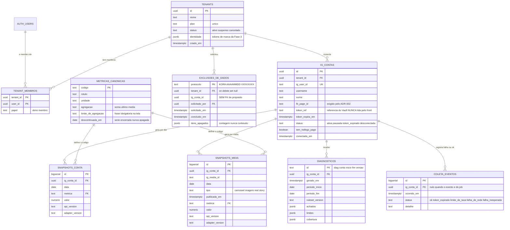

# Esquema — tabelas, RLS e retenção

> O SQL está em `supabase/schema.sql`. Aqui está o que ele não diz: por que cada
> coluna existe, por que a RLS é desenhada assim e o que acontece com o dado no
> fim da vida dele.
> Última revisão: 2026-09-05.

---

## 1. Diagrama ER



Duas ligações do diagrama merecem leitura atenta:

- **`exclusoes_de_dados.ig_conta_id` não tem FK.** A linha existe justamente
  para sobreviver à exclusão que ela registra. Uma FK com cascade apagaria o
  comprovante junto com o dado, e um comprovante que some não comprova nada.
- **`metricas_canonicas` é dicionário, não dado de cliente.** Ela diz o que
  "alcance" significa. Por isso a política de leitura dela é `using (true)` para
  qualquer usuário autenticado: esconder por tenant não protegeria nada e
  quebraria a tela.

---

## 2. Tabela a tabela, coluna por coluna

### `tenants` — a marca ou agência assinante

| Coluna | Por que existe |
|---|---|
| `nome` | o que aparece no cabeçalho do relatório ("Preparado por Estúdio Vergara") |
| `plan` | plano único hoje (`'unico'`), modelado desde já porque coluna nova em tabela com RLS custa migration, revisão de `grant` por coluna e teste de isolamento |
| `status` | `ativo`, `suspenso`, `cancelado`, fechados por `check`. Nenhum código escreve isso hoje (`docs/03_REGRAS_DE_NEGOCIO/modulo-assinatura.md`) |
| `identidade` | tokens de marca do white-label da Fase 3. Fica no tenant e **nunca no código**, porque CLAUDE.md proíbe cor, logo ou nome de cliente hardcodado. O conteúdo é validado por `src/tema/identidadeVisual.js` antes de virar CSS: o banco guarda o que o tenant mandou, a aplicação decide o que aplica |

### `tenant_membros` — o vínculo que a RLS inteira consulta

Chave primária composta `(tenant_id, user_id)`: um usuário aparece uma vez por
tenant, e a unicidade é estrutural em vez de depender de índice adicional.

`papel` (`dono`, `membro`) existe para a autorização que ainda não foi escrita —
hoje nenhuma política distingue os dois. Índice extra em `user_id` porque a
chave primária começa por `tenant_id` e o caminho mais quente é o inverso: "quais
tenants são deste usuário?".

### `ig_contas` — a conta conectada

| Coluna | Por que existe |
|---|---|
| `ig_user_id` | id da conta profissional na Meta, com `unique`: a mesma conta não pode ser conectada duas vezes, nem sequestrada por outro tenant |
| `username` | o `@` que o cliente reconhece |
| `nome` | nome de exibição; sem ele a tela cai no `@` (`src/lib/contas.js`) |
| `fb_page_id` | a Página do Facebook vinculada, exigida pela variante do ADR-002 |
| `token_ref` | **referência** ao Supabase Vault, nunca o token. Fora de todo `grant` para `authenticated` |
| `token_expira_em` | data de vencimento do token longo (~60 dias). Hoje nada lê essa coluna — ver `modulo-conexao.md`, seção 4 |
| `status` | governa quem coleta e quem diagnostica. A coleta só roda em `ativa` |
| `tem_trafego_pago` | quando falso, o motor **obriga** a tela a declarar que tudo ali vale para alcance orgânico. Sem esse dado, a tela atribuiria ao conteúdo um alcance que veio de anúncio |
| `conectada_em` | ordena a listagem e a fila de coleta; é também o marco a partir do qual existe histórico próprio (ADR-004) |

### `metricas_canonicas` — o dicionário (ADR-003)

Nome da Meta nunca vira coluna. As duas colunas que carregam decisão de produto:

- **`agregacao`** — `soma`, `ultimo` ou `media`. Não é detalhe: seguidores é
  estoque e vale o último saldo da semana; alcance é fluxo e soma. Somar
  seguidores por sete dias daria sete vezes a conta.
- **`limite_de_agregacao`** — a frase que a tela é **obrigada** a mostrar quando
  a métrica for somada por janela. Só `alcance` tem uma, porque somar alcance de
  várias semanas conta duas vezes quem foi alcançado em duas, e a Meta não
  devolve alcance único de período longo. Limite de plataforma vira texto, nunca
  silêncio.
- **`descontinuada_em`** — série encerrada com data, nunca apagada nem
  recalculada. O dashboard mostra a descontinuidade.

### `snapshots_conta` e `snapshots_midia` — o ativo do produto (ADR-004)

Append-only. O que a Graph API não devolve depois é o passado de antes da
conexão: dia não coletado hoje não existe amanhã.

| Coluna | Por que existe |
|---|---|
| `data` | o dia **fechado** a que a leitura se refere, nunca o dia em curso |
| `metrica` | FK para o dicionário: código fora dele não entra, nem como coluna nova |
| `valor` | `numeric`, não `integer`: métrica derivada e média entram sem perda |
| `api_version`, `adapter_version` | rastreabilidade obrigatória (ADR-003). Sem elas não dá para responder se uma quebra de série foi mudança da conta ou mudança de definição da Meta |
| `unique (ig_conta_id, data, metrica)` | recoletar o mesmo dia atualiza a linha em vez de duplicá-la |
| `unique (ig_media_id, data, metrica)` | idem para mídia; é o que permite reler os últimos 7 dias todo dia sem inflar a tabela |
| `tipo`, `publicada_em` (mídia) | o vocabulário das regras (`reel`, `carrossel`, `imagem`, `story`) e a semana em que a publicação entra |

### `diagnosticos` — o registro que a tela lê (ADR-005)

| Coluna | Por que existe |
|---|---|
| `id` **`text`**, não `uuid` | vem de `idDoDiagnostico` e é determinístico: `diag:<conta>:<inicio>:<fim>:<versao>`. Reprocessar o mesmo período com o mesmo ruleset precisa cair na **mesma** linha; com uuid aleatório cada reprocessamento viraria registro novo e a pergunta "mudou a conta ou mudou a regra?" perderia resposta |
| `ruleset_version` | sem ela não há auditoria, e o produto perde o argumento que sustenta o preço |
| `achados` | jsonb com a lista já ordenada por peso. É jsonb, e não tabela filha, porque o achado é lido inteiro, sempre, e nunca consultado por campo |
| `limites` | o que **este** diagnóstico não sabe. Não é enfeite: a tela é proibida de mostrar veredito sem os limites que o sustentam |
| `cobertura` | quantas semanas completas, primeiro dado, lacunas e `suficiente` — o campo que separa "está tudo bem" de "ainda não dá para saber" |
| `check (periodo_fim >= periodo_inicio)` | período invertido é bug que só apareceria no relatório do cliente |

### `coleta_eventos` — a lacuna que a tela precisa mostrar (ADR-004)

`ig_conta_id` **nulo** quando o evento é do job inteiro (o cron caiu antes de
escolher conta). A política de leitura filtra por conta, então evento sem conta
fica só para o operador: cliente não vê falha que não é da conta dele.

`status` tem vocabulário fechado por `check` porque `montarHistorico` traduz
status em frase de lacuna. Status desconhecido vira "A coleta do dia falhou.",
que informa menos do que "Token expirado" — prevenção de erro acima de mensagem
de erro.

### `exclusoes_de_dados` — o comprovante

`protocolo` é a chave primária e é legível de propósito (`KORA-AAAAMMDD-XXXXXXXX`):
o cliente vai ditar isso por telefone, e um uuid cru convida a erro de
transcrição. `itens_apagados` guarda **contagem**, nunca conteúdo — o comprovante
não pode ser a cópia do que foi apagado.

### Índices

Só existem os das consultas que existem de verdade:

| Índice | Consulta que ele serve |
|---|---|
| `snapshots_conta (ig_conta_id, data)` | série semanal por conta e faixa de data |
| `snapshots_midia (ig_conta_id, data)` | idem, mídia |
| `diagnosticos (ig_conta_id, gerado_em desc)` | "o diagnóstico mais recente desta conta" |
| `coleta_eventos (ig_conta_id, ocorrido_em desc)` | eventos recentes da conta |
| `tenant_membros (user_id)` | o caminho por usuário, que a PK não cobre |
| `ig_contas (tenant_id)` | listagem de contas do tenant |

Sem os dois primeiros, as duas telas principais varrem a tabela inteira.

---

## 3. A estratégia de RLS, em português

### O problema tem duas metades, e uma trava só resolve uma

**RLS filtra linha. Nenhuma política esconde coluna.** E `ig_contas.token_ref` é
exatamente um problema de coluna: a linha da conta precisa ser legível pelo
dono, a referência do cofre não. Por isso o schema usa **duas travas
independentes**, e as duas precisam existir:

1. **`grant` por coluna.** Primeiro `revoke all on all tables in schema public
   from anon, authenticated` — default-deny, porque confiar no que sobrou do
   padrão do Supabase é como o token vaza. Depois, `grant select (colunas)`
   explícito, tabela por tabela. Em `ig_contas`, `token_ref` **fica de fora**, e
   essa ausência é a regra, não esquecimento.
2. **RLS.** A linha só aparece se pertence a um tenant do usuário.

Escolhemos privilégio de coluna em vez de uma view por três razões:
`src/lib/contas.js` consulta `from('ig_contas')` e esse nome está fixado em
`contratos.md`; a view protege quem passa por ela, enquanto o privilégio protege
a coluna em todo caminho (PostgREST, psql, um serviço futuro); e, como efeito
colateral útil, `select *` passa a falhar com *permission denied for column
token_ref* — a regra "nada de `select *`" deixa de depender de review e passa a
ser verificada pelo banco.

### Todo acesso desce por duas funções

```sql
public.tenants_do_usuario()  -- tenants do auth.uid() atual
public.contas_do_usuario()   -- contas dos tenants acima
```

As duas são `security definer`, e isso não é preferência:

- A política de `tenant_membros` precisa consultar `tenant_membros` para saber se
  a linha é do usuário. Uma política que lê a própria tabela **reentra na
  política** e o Postgres aborta com recursão infinita (42P17). `security
  definer` executa como o dono da função, que não passa pela RLS da tabela lida,
  e corta o ciclo.
- `stable` faz o planner avaliar a função **uma vez por consulta** (InitPlan) em
  vez de uma vez por linha — a diferença entre uma varredura e milhares.
- `search_path` fixo é obrigatório: sem ele, quem chama escolhe qual
  `tenant_membros` a função enxerga.

`contas_do_usuario()` existe um nível abaixo pelo mesmo motivo de custo: sem ela,
cada política de snapshot faria um subselect em `ig_contas` sujeito a RLS,
encadeando duas políticas por linha.

### Quem pode ler o quê

| Tabela | `authenticated` | `service_role` |
|---|---|---|
| `tenants` | select das linhas dos seus tenants | tudo |
| `tenant_membros` | select das linhas dos seus tenants | tudo |
| `ig_contas` | select, **sem `token_ref`** | tudo |
| `metricas_canonicas` | select de tudo (é dicionário) | tudo |
| `snapshots_conta`, `snapshots_midia` | select das suas contas | tudo |
| `diagnosticos` | select das suas contas | tudo |
| `coleta_eventos` | select das suas contas; evento de job (`ig_conta_id` nulo) fica invisível | tudo |
| `exclusoes_de_dados` | select dos seus tenants | tudo |
| `anon` | **nada** | — |

`anon` não lê nada porque as rotas públicas (`/privacidade`, `/dados`) são
conteúdo estático e não consultam o banco (`contratos.md`, seção 6).

### Sobre as políticas de `service_role`

O papel tem `BYPASSRLS`. As políticas `..._servico` do schema **não são o que
autoriza a Edge Function**: elas declaram a intenção por escrito e continuam
valendo se um dia a coleta rodar com um papel sem bypass. O que de fato impede o
cliente de escrever linha de coleta é a **ausência** de política de
INSERT/UPDATE para `authenticated` somada à **ausência** do `grant`.

### O cofre

Três funções `security definer` — `guardar_token`, `ler_token`, `apagar_token` —
com `EXECUTE` revogado de `public`, `anon` e `authenticated`, concedido só a
`service_role`. Se `ler_token` fosse executável pelo usuário logado, o Vault
viraria enfeite: qualquer membro de qualquer tenant pediria o token de qualquer
conta pelo PostgREST.

### O que o teste de políticas prova, e o que não prova

`supabase/politicas.test.js` lê o SQL como texto. Ele garante que toda tabela tem
RLS, que toda tabela com RLS tem política de leitura para `authenticated`
(política só para `service_role` não conta), que nenhum `grant` de coluna inclui
`token_ref`, que as funções de cofre não são executáveis pelo usuário logado e
que as migrations não divergiram do `schema.sql`.

**Ele não prova que a política filtra certo.** Para isso é preciso banco de
verdade, dois tenants e duas sessões. Esse teste continua no backlog, e é
`definition of done` de tabela nova segundo `contratos.md`. Até ele existir, o
roteiro manual de `supabase/README.md` roda a cada mudança de política.

---

## 4. Retenção e exclusão

### O que já está decidido

| Situação | O que acontece com o dado |
|---|---|
| Falha de coleta | nada é apagado; nasce linha em `coleta_eventos` e a lacuna aparece na tela |
| Métrica descontinuada pela Meta | série **encerrada com data**, nunca apagada nem recalculada (ADR-003) |
| Ruleset novo | diagnóstico antigo **não é reescrito**; nasce registro novo ao lado (ADR-005) |
| Reprocessar o mesmo período | cai na mesma linha, pelo `id` determinístico |
| Exclusão a pedido | apaga snapshots, diagnósticos, eventos, token e a linha da conta; grava protocolo com contagem |
| Tenant apagado | `on delete cascade` leva contas, snapshots, diagnósticos e eventos; o protocolo de exclusão sobrevive com `tenant_id` nulo |

Ordem da exclusão, da folha para a raiz: `snapshots_midia`, `snapshots_conta`,
`diagnosticos`, `coleta_eventos`, depois o token no Vault, depois `ig_contas`. A
FK já tem `on delete cascade` e apagar só a conta bastaria — apagamos
explicitamente mesmo assim porque **o comprovante precisa dizer quanto** foi
apagado, e porque um `on delete` que mude no futuro não pode transformar exclusão
de dado pessoal em órfão silencioso.

O token sai do cofre **antes** da linha: com a linha apagada, `token_ref` se
perde e o segredo ficaria no Vault sem ninguém para reclamá-lo.

### O que não está decidido

| Pergunta | Consequência de não decidir |
|---|---|
| Prazo de retenção após cancelamento da assinatura | sem prazo declarado não há política de privacidade, e sem política não há App Review |
| Prazo de retenção de `coleta_eventos` | tabela cresce sem teto; hoje é a que mais gera linha por dia depois dos snapshots |
| Prazo de guarda do próprio `exclusoes_de_dados` | o comprovante precisa sobreviver ao dado, mas não para sempre |
| Se desconectar (sem excluir) mantém o histórico frente aos Meta Platform Terms | item bloqueante de App Review (`docs/03_REGRAS_DE_NEGOCIO/conformidade.md`, seção 4) |

Nenhum job de expurgo existe. **Onde a decisão mora:** ADR novo, refletido no
texto de `/privacidade` e numa migration que crie o expurgo.

### Crescimento esperado

Cerca de **12 KB por conta por dia** (1 snapshot de conta e ~30 de mídia), o que
dá ~88 MB por ano com 20 contas — dentro dos 500 MB do Supabase Free
(`docs/12`, seção 2.1). Armazenamento não é o gargalo desta fase; o gargalo é o
teto de testers do Development mode.

---

## 5. Conflitos abertos entre documento e realidade

| Conflito | Estado |
|---|---|
| ADR-005 chama a tabela de `diagnoses`; o schema usa `diagnosticos` | resolvido por emenda no próprio ADR |
| `ig_contas.status = 'pausada'` e `tenants.status` não têm escritor | intenção pendente, registrada em `modulo-assinatura.md` |
| `tenant_membros.papel` não é usado por nenhuma política | autorização por papel não foi escrita |
| Teste de isolamento entre tenants com banco real | no backlog, e é definition of done de tabela nova |
