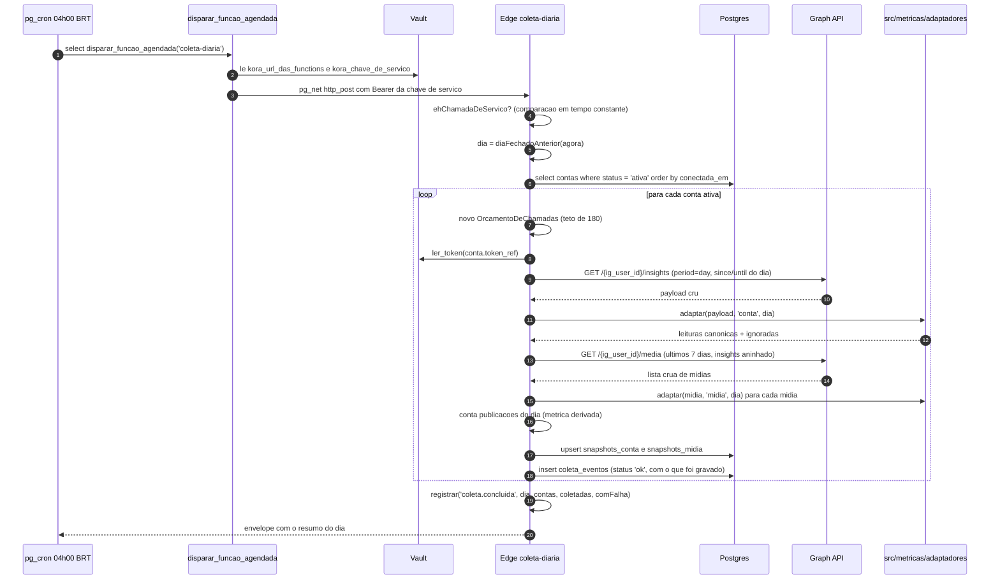
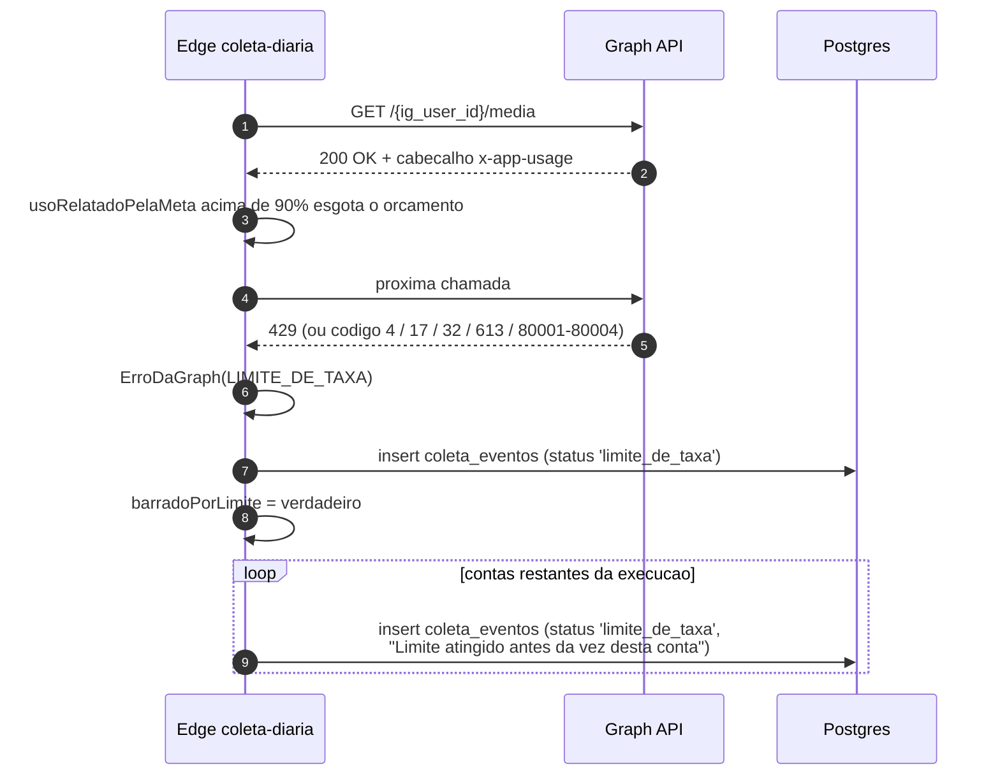

# Fluxo de coleta — o snapshot que vira o histórico

> O que a Graph API não devolve depois é o passado de antes da conexão. Se um dia
> não for coletado hoje, ele não existe amanhã (ADR-004). Por isso este fluxo
> trata falha como **dado**, não como exceção.
> Código: `supabase/migrations/20260905120200_agendamento_da_coleta.sql`,
> `supabase/functions/coleta-diaria/`, `supabase/functions/_compartilhado/graphApi.ts`,
> `src/metricas/adaptadores/`. Última revisão: 2026-09-05.

---

## 1. Caminho feliz



### Por que cada decisão do laço é como é

| Decisão | Motivo |
|---|---|
| **Só contas `ativa`** | conta com token vencido gastaria orçamento das que ainda funcionam, e a tela já tem o que dizer ao cliente |
| **Dia fechado anterior**, nunca o dia em curso | coletar o dia em curso gravaria meia jornada como dia inteiro, e o motor compararia uma segunda-feira pela metade com semanas completas — uma queda que não aconteceu |
| **7 dias de mídia** (`DIAS_DE_MIDIA`) | métrica de mídia é total acumulado e continua se movendo depois da publicação; reler a última semana mantém o número da semana corrente vivo até ela fechar. A chave `unique (ig_media_id, data, metrica)` garante que reler não duplica |
| **`insights` aninhado no `fields` da mídia** | uma chamada por lote em vez de uma por mídia; com 200 chamadas/hora, cada ida evitada é uma conta a mais coletada no mesmo dia |
| **Um orçamento por conta** | o teto da Meta é por usuário; gastar o de uma conta não pode consumir o das outras |
| **`publicacoes` gravada mesmo valendo zero** | ali o zero é fato observado ("não publicou"), e não ausência de coleta. A distinção é o que separa lacuna de queda |
| **Token no cabeçalho `Authorization`** | URL vai para log de proxy, histórico e relatório de erro |

### O adaptador, e o nome que morre na porta

O adaptador vem de `src/metricas/adaptadores/`, importado pela função em vez de
copiado. Ele é o único lugar do produto que conhece nome de métrica da Meta
(ADR-003), já é versionado e testado — duas cópias dariam dois significados para
"alcance", que divergiriam na primeira mudança da Meta.

Cada linha gravada leva `api_version` e `adapter_version`. Sem elas não dá para
responder se uma quebra de série foi mudança da conta ou mudança de definição da
Meta.

Métrica que a Meta manda e que não está no dicionário entra em `ignoradas` e
aparece no evento de coleta do dia (`Métricas ignoradas: ...`, até cinco). Ela
**nunca** vira coluna nova.

### O cron também é o batimento cardíaco

O job diário tem uma segunda função que quase ninguém anota: o Supabase Free
pausa projeto ocioso por 7 dias (`docs/12`, seção 1.1), e projeto pausado não
coleta — a pausa apagaria justamente a série que o produto vende.

`0 7 * * *` é 04:00 em America/Sao_Paulo, porque o pg_cron avalia no fuso do
servidor (UTC) e o Brasil não tem horário de verão desde 2019. **Se voltar a ter,
essa linha muda** — o cron não descobre sozinho.

---

## 2. Caminho infeliz: token expirado no meio da coleta

```mermaid
sequenceDiagram
    autonumber
    participant Funcao as Edge coleta-diaria
    participant Vault
    participant Meta as Graph API
    participant PG as Postgres

    Funcao->>Vault: ler_token(conta.token_ref)
    alt segredo ausente no cofre
        Vault-->>Funcao: vazio
        Funcao->>Funcao: ErroDaGraph(TOKEN_EXPIRADO, "Token ausente no cofre")
    else segredo existe
        Funcao->>Meta: GET /{ig_user_id}/insights
        Meta-->>Funcao: erro 190 / 102 / 463 / 467
        Funcao->>Funcao: classificarErro devolve TOKEN_EXPIRADO
    end
    Funcao->>PG: insert coleta_eventos (status 'token_expirado', detalhe)
    Funcao->>PG: update ig_contas set status = 'token_expirado'
    Note over Funcao: a conta sai do loop dos proximos dias;<br/>as demais contas CONTINUAM sendo coletadas
```

O que o cliente vê depois, e é o ponto do produto inteiro: `montarHistorico`
transforma o evento em lacuna nomeada — *"Token expirado: a coleta do dia não
aconteceu."* — e é assim que ele descobre que a queda do gráfico foi o token dele
vencendo, e não o conteúdo dele piorando (ADR-004, e "honestidade de dado" em
`memory/identity.md`).

Referência sem segredo no cofre é tratada como token vencido de propósito:
significa conexão quebrada, e a ação do cliente é a mesma — reconectar.

---

## 3. Caminho infeliz: limite de taxa

O teto é de **200 chamadas por hora por usuário** (`memory/restrictions.md`).
O orçamento local para em 90% dele — 180 chamadas — e os 10% restantes ficam para
o que não passa pelo orçamento: retentativa, chamada manual de suporte e o atraso
entre a contagem da Meta e a nossa.



**Cada conta restante ganha o próprio evento.** Não é burocracia: sem esse
registro, a lacuna do dia apareceria na tela dessas contas **sem motivo**, e
lacuna sem motivo é exatamente o que o ADR-004 proíbe.

Ler o cabeçalho `x-app-usage` em vez de esperar o 429 é o que evita descobrir o
problema depois de já ter perdido a janela da hora. Estourar o limite não custa
só a chamada recusada: custa a hora seguinte inteira, e com ela a coleta de todas
as contas que ainda não rodaram.

---

## 4. Caminho infeliz: falha de rede e falha inesperada

| Situação | `coleta_eventos.status` | Frase de lacuna na tela |
|---|---|---|
| Meta responde 5xx, ou o `fetch` estoura os 20 s | `falha_de_rede` | "Falha de rede: a coleta do dia não completou." |
| Banco recusa o upsert de snapshot | `falha_inesperada` | "A coleta do dia falhou." |
| Não foi possível listar as contas ativas | `falha_inesperada`, com `ig_conta_id` **nulo** | invisível ao cliente, visível ao operador |
| Cron sem segredos no Vault | `falha_inesperada`, `ig_conta_id` nulo | idem |

Evento com `ig_conta_id` nulo cai fora do `in (...)` da política de leitura e não
aparece para o cliente — que é o comportamento desejado: cliente não vê falha que
não é da conta dele.

E `registrarEvento` **nunca lança**: se até o registro da falha falhar, o que
sobra é o log, e a coleta das outras contas precisa continuar.

---

## 5. Como o dia sem coleta vira lacuna

`montarHistorico` deriva lacuna de **duas fontes independentes**, e uma não
substitui a outra — a coleta pode falhar e ainda assim gravar linha parcial, e
pode faltar linha sem ninguém ter registrado o erro:

```
1. dia dentro do intervalo ja coletado que NAO tem snapshot
   -> "Sem coleta registrada neste dia."
2. evento de coleta com status <> 'ok'
   -> a frase daquele status (o evento nomeado ganha do silencio)

dias contiguos com o mesmo motivo viram UMA lacuna, nao cinco avisos iguais
```

E a semana afetada perde o direito de entrar em comparação:

```
SE semana.diasComColeta < 7 ENTAO semana.completa = falso
```

---

## 6. O que este fluxo nunca faz

- **Não conserta série.** Dia sem coleta não vira zero, semana pela metade não
  vira semana.
- **Não loga payload nem token.** O log da execução leva dia, total de contas,
  coletadas e com falha. O detalhe de cada conta já está em `coleta_eventos`.
- **Não aceita chamada sem chave de serviço.** Sem `ehChamadaDeServico`, qualquer
  um na internet dispararia a coleta de todas as contas do produto.
- **Não inventa métrica.** Código fora do dicionário canônico não vira coluna.
