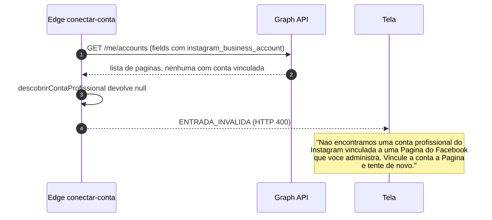
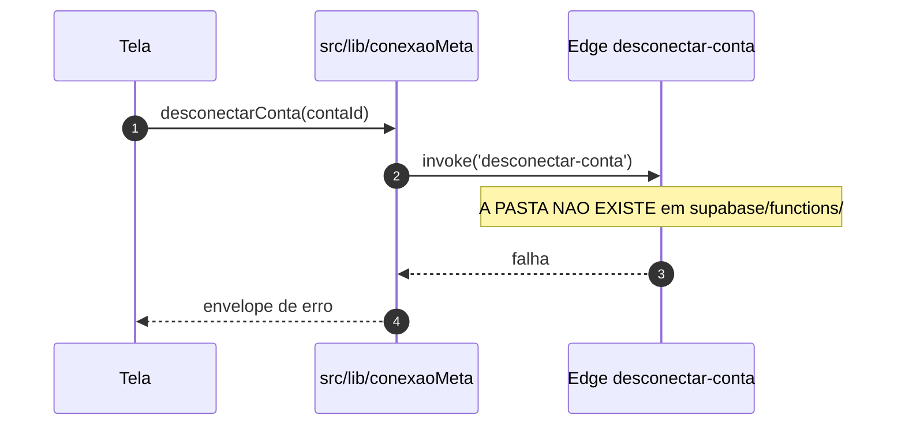
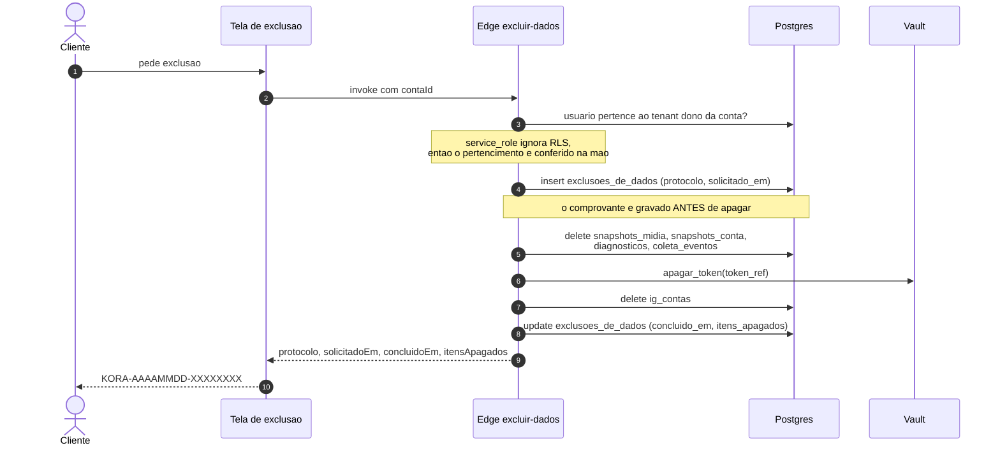

# Fluxo de conexão — do consentimento ao cofre

> Como uma conta profissional do Instagram vira uma linha em `ig_contas` e um
> segredo no Vault, e o que acontece quando cada etapa falha.
> Código: `src/lib/conexaoMeta.js`, `supabase/functions/conectar-conta/`,
> `supabase/functions/excluir-dados/`, `supabase/functions/_compartilhado/graphApi.ts`.
> Regras: `docs/03_REGRAS_DE_NEGOCIO/modulo-conexao.md`. Última revisão: 2026-09-05.

---

## 1. Caminho feliz

```mermaid
sequenceDiagram
    autonumber
    actor Cliente
    participant Tela as Tela de conexao
    participant Servicos as src/lib/conexaoMeta
    participant Meta as Graph API
    participant Funcao as Edge conectar-conta
    participant Vault
    participant PG as Postgres

    Cliente->>Tela: abre /conectar
    Note over Tela: A tela explica o requisito da Pagina<br/>do Facebook ANTES do clique (ADR-002)
    Cliente->>Tela: clica em Conectar
    Tela->>Servicos: urlDeConsentimento()
    Servicos->>Servicos: gera estado (128 bits de crypto)
    Servicos->>Servicos: guarda estado em sessionStorage
    Servicos-->>Tela: url do dialogo, scope com as 4 permissoes
    Tela->>Meta: redireciona para o dialogo
    Cliente->>Meta: autoriza
    Meta-->>Tela: volta em /conectar/retorno com code e state
    Tela->>Servicos: concluirConexao(code, state)
    Servicos->>Servicos: consome o estado guardado e compara
    Servicos->>Funcao: invoke com code e redirect_uri
    Funcao->>Funcao: valida sessao, redirect_uri e tenant
    Funcao->>Meta: POST /oauth/access_token, troca o code por token curto
    Funcao->>Meta: POST /oauth/access_token, troca curto por longo de ~60 dias
    Funcao->>Meta: GET /me/accounts com instagram_business_account
    Meta-->>Funcao: pagina + conta profissional vinculada
    Funcao->>PG: ja existe conta com este ig_user_id?
    Funcao->>Vault: guardar_token(nome, token)
    Vault-->>Funcao: referencia (uuid)
    Funcao->>PG: insert/update ig_contas com token_ref e status ativa
    Funcao-->>Servicos: envelope com a conta, SEM token_ref
    Servicos-->>Tela: envelope
    Tela-->>Cliente: conta conectada; primeiro diagnostico em ate 24 h
```

Três coisas que o diagrama esconde e o código não:

- **O `code` sai do navegador direto para o servidor.** O app secret da Meta não
  existe no bundle do front, e o token de acesso nunca volta na resposta.
- **O token vai ao cofre antes de a linha existir.** Linha apontando para
  referência vazia produziria uma conta "conectada" que nunca coleta.
- **O log da conexão registra tenant, conta e se foi reconexão.** Não registra
  `code`, token nem referência do cofre.

---

## 2. Caminho infeliz: conta sem Página do Facebook vinculada

O mais provável de todos, e o motivo pelo qual a tela `/conectar` existe antes
do clique (ADR-002 chama isso de "fricção real no onboarding").



**Nada é gravado.** Não há linha em `ig_contas`, não há segredo no Vault, e o
token curto obtido na troca é descartado com a execução.

Regra de produto: esta falha **não** é tratada como erro do cliente. Na call de
venda, resolver o vínculo junto é demonstração de suporte, não objeção
(`docs/13_VENDA`, seção 6), e a taxa de conexão concluída na própria call é a
métrica que mede a fricção do ADR-002.

---

## 3. Caminho infeliz: retorno que não confere

Três recusas distintas, todas antes de qualquer efeito colateral:

| Situação | Onde é barrada | Código |
|---|---|---|
| `state` diferente do guardado, ou ausente | front, em `concluirConexao` | `ENTRADA_INVALIDA` |
| `code` fora de formato | front e servidor | `ENTRADA_INVALIDA` |
| `redirect_uri` fora de `KORA_REDIRECIONAMENTOS_PERMITIDOS` | servidor | `ENTRADA_INVALIDA` |

O estado é de **uso único**: consumido na primeira volta, um retorno repetido
(por histórico do navegador ou link reenviado) não conclui conexão de novo. E a
conferência acontece **antes** de olhar o modo de execução: retorno que não
confere é recusado em todo ambiente, sem exceção.

Sem essa checagem, um terceiro monta um retorno de OAuth com o `code` da conta
*dele* e induz o cliente a clicar; o navegador do cliente chega ao nosso callback
já autenticado, e a conta do atacante fica vinculada ao tenant da vítima — que
passa a ver diagnóstico de um perfil que não é o seu.

---

## 4. Caminho infeliz: a conta já pertence a outro tenant

```
SE existe ig_contas com este ig_user_id
   E o tenant dela <> o tenant desta conexao ENTAO
  -> SEM_PERMISSAO (HTTP 403)
  -> "Esta conta do Instagram ja esta conectada em outro espaco de trabalho."
FIM
```

Sem essa checagem, um `upsert` por `ig_user_id` **moveria** a conta — e o
histórico inteiro dela — para quem conectasse por último. É o pior tipo de bug
de multi-tenant: silencioso, e só descoberto pelo cliente que perdeu a série.

---

## 5. Caminho infeliz: a Meta recusa a troca

| Recusa da Meta | Classificação | HTTP | O que a tela diz |
|---|---|---|---|
| códigos 190, 102, 463, 467 | `TOKEN_EXPIRADO` | 409 | reconecte a conta |
| 429, ou códigos 4, 17, 32, 613, 80001–80004 | `LIMITE_DE_TAXA` | 429 | tente de novo em alguns minutos |
| 5xx | `FALHA_DE_REDE` | 502 | não foi possível falar com o servidor |
| qualquer outra | `FALHA_INESPERADA` | 500 | algo saiu do esperado |

A classificação acontece em `graphApi.ts` e é o que permite ao front distinguir
"reconecte" de "espere" — dois estados que só quem fala com a Graph API sabe
nomear, e que virariam `FALHA_INESPERADA` se a função respondesse erro cru.

A mensagem da Meta entra no detalhe **cortada em 200 caracteres**: ela às vezes
ecoa parte da requisição, e requisição nossa carrega id de conta.

---

## 6. Caminho infeliz: modo de demonstração

```
SE estaEmModoDemonstracao() ENTAO
  concluirConexao, desconectarConta e solicitarExclusaoDeDados
  devolvem falha com a mensagem
  "Modo demonstracao: nenhuma conta real e conectada, desconectada ou excluida aqui."
FIM
```

Falha explícita, e não sucesso simulado. Simular conexão bem-sucedida na
demonstração seria criar um caminho que ninguém mantém e que mente na call de
venda (ADR-007).

---

## 7. Desconexão — o fluxo que ainda não existe



`FUNCOES.desconectarConta` aponta para a pasta `desconectar-conta`, que não foi
escrita. Enquanto ela não existir, **o botão de desconectar não pode ser
oferecido na tela como se funcionasse**.

O que a função precisa fazer quando nascer, e que nenhum atalho pelo front
resolve (apagar segredo do Vault é operação de `service_role`):

```
1. conferir que o usuario pertence ao tenant dono da conta
2. apagar_token(conta.token_ref)
3. ig_contas.status = 'desconectada', token_ref esvaziado
4. NAO apagar snapshots, diagnosticos nem eventos
```

---

## 8. Exclusão de dados

Exigida pela LGPD e pelo App Review (`docs/03_REGRAS_DE_NEGOCIO/conformidade.md`).



Falha no meio do caminho:

```
SE qualquer passo falhar ENTAO
  o protocolo fica gravado SEM concluido_em
  a resposta e FALHA_INESPERADA com o protocolo na mensagem
  "A exclusao nao foi concluida. Guarde o protocolo <X> e fale com o suporte."
FIM
```

Exclusão incompleta **aparece** para quem auditar, em vez de sumir. O log da
operação registra só o protocolo — sem id de conta, sem username, sem tenant:
o log de uma exclusão não pode virar a cópia que sobrou do que foi apagado.
