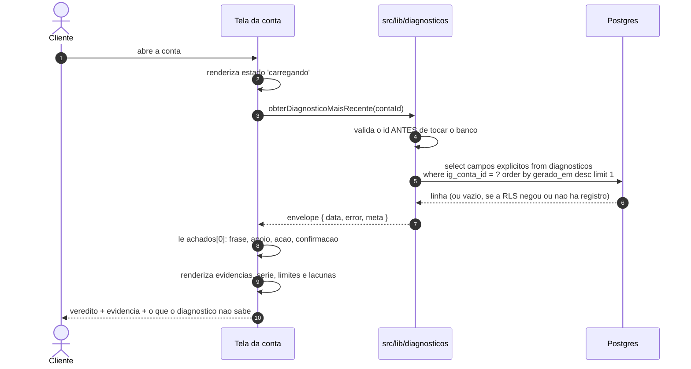
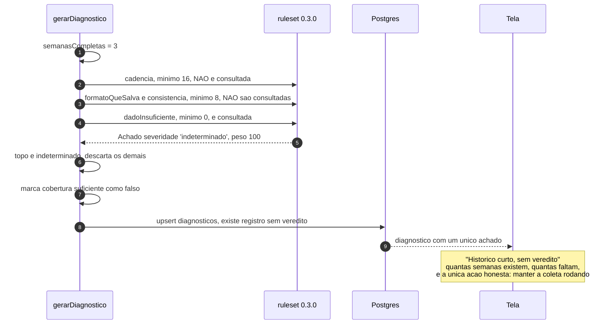
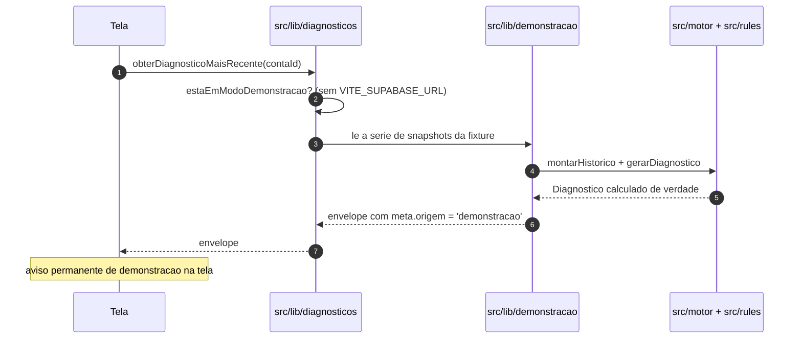

# Fluxo de diagnóstico — do histórico à frase

> O motor roda no servidor, grava um registro com a versão da regra que usou, e a
> tela lê. A tela nunca calcula nada (ADR-005).
> Código: `supabase/functions/gerar-diagnostico/`, `src/motor/`, `src/rules/`,
> `src/lib/diagnosticos.js`. Regras:
> `docs/03_REGRAS_DE_NEGOCIO/modulo-diagnostico.md`. Última revisão: 2026-09-05.

---

## 1. Caminho feliz — o servidor gera

```mermaid
sequenceDiagram
    autonumber
    participant Cron as pg_cron 04h40 BRT
    participant Funcao as Edge gerar-diagnostico
    participant PG as Postgres
    participant Motor as src/motor
    participant Regras as src/rules 0.3.0

    Cron->>Funcao: disparar_funcao_agendada('gerar-diagnostico')
    Funcao->>Funcao: ehChamadaDeServico?
    Funcao->>PG: select contas where status in (ativa, pausada, token_expirado)

    loop para cada conta
        Funcao->>PG: snapshots_conta, snapshots_midia e coleta_eventos<br/>das ultimas 24 semanas, em paginas de 1000
        Funcao->>Motor: montarHistorico(conta, snapshots, eventos, ate)
        Motor->>Motor: agrupa por semana ISO, agrega pelo dicionario
        Motor->>Motor: marca semana incompleta e deriva lacunas
        Motor-->>Funcao: Historico
        Funcao->>Motor: gerarDiagnostico(historico, ruleset, {agora})
        Motor->>Regras: avaliar() de cada regra com minimo atendido
        Regras-->>Motor: Achado ou null
        Motor->>Motor: ordena por peso; se o topo e indeterminado, descarta o resto
        Motor->>Motor: resolve limites (da regra + os que valem sempre)
        Motor-->>Funcao: Diagnostico com id deterministico
        Funcao->>PG: upsert diagnosticos on conflict (id)
    end

    Funcao-->>Cron: contas, gerados, comFalha, ruleset
```

### Por que 04:40, e por que 24 semanas

O motor lê o que a coleta gravou, então corre depois — e com folga. A coleta
percorre todas as contas ativas respeitando o limite de 200 chamadas por hora, e
apertar a janela faria o diagnóstico do dia nascer sobre uma série incompleta.

As 24 semanas cobrem com folga as 16 exigidas pela regra mais exigente do ruleset
0.3.0, e param aí: ler a série inteira de uma conta antiga custaria memória sem
mudar nenhum veredito.

### Por que a paginação é explícita

O PostgREST corta a resposta em 1000 linhas por padrão, **em silêncio**. Série
truncada não quebra nada — ela produz um diagnóstico plausível e errado, com
semanas antigas faltando e uma "queda" que é só o corte da consulta. Este é o
tipo de bug que só o cliente descobre, e na reunião dele.

### Por que conta com token vencido continua sendo diagnosticada

O histórico dela não some porque a coleta parou. Se ela saísse da lista, a tela
ficaria vazia — e tela vazia é lacuna escondida (ADR-004). Com ela dentro, o
cliente vê o histórico que existe **e** a lacuna que cresce, com o motivo
nomeado.

---

## 2. Caminho feliz — a tela lê



A tela **não** calcula nada: a frase, os números das evidências, a variação e o
`tom` de cada indicador já vêm prontos no registro. O que ela faz é ler,
formatar em pt-BR e navegar.

O relatório (`/contas/:contaId/relatorio`) é **o mesmo registro** em folha clara,
nunca um segundo cálculo. O PDF é a impressão do navegador: custo zero e saída
idêntica ao que o cliente viu na tela, sem um segundo gerador para manter em
sincronia.

---

## 3. Caminho infeliz: histórico curto demais

O caso da conta Studio Nove da fixture — três semanas de histórico (ADR-007).



Três regras que este caminho fixa:

1. **Existe registro.** "Ainda não sei" é um diagnóstico gravado, com
   `ruleset_version`, e não a ausência de um.
2. **Não há palpite.** Nenhuma frase provisória, nenhuma tendência estimada.
3. **O que a tela mostra é o número real**: quantas semanas completas existem,
   quantas faltam para 16 e quantos dias sem coleta atrasaram a conta.

Entre 8 e 15 semanas completas, `formato-que-salva` e `consistencia-de-alcance`
seriam consultadas e produziriam achado — que é descartado, porque
`dado-insuficiente` ainda dispara e tem peso maior. Consequência registrada em
`modulo-diagnostico.md`, seção 2.

Na camada de serviços, o código correspondente é `SEM_DADO_SUFICIENTE`: conta
visível, sem diagnóstico ou sem coleta ainda.

---

## 4. Caminho infeliz: a conta tem lacuna, mas tem histórico

O caso da Verdejar Plantas — conta saudável com 5 dias sem coleta.

```
1. montarHistorico marca as semanas afetadas como completa = falso
2. as semanas incompletas NAO entram em nenhuma janela de comparacao
3. as lacunas viram { inicio, fim, motivo } em cobertura.lacunas
4. o periodo do diagnostico termina na ultima semana COMPLETA
5. a tela mostra o veredito E o bloco "Dias sem coleta", com o motivo
```

A série do gráfico **não liga dois pontos por cima da semana sem coleta**:
`segmentosDaLinha` quebra a linha e a retoma quando o dado volta. Ligar
desenharia uma tendência que ninguém mediu.

---

## 5. Caminho infeliz: a leitura da tela volta vazia

RLS que nega **leitura** devolve conjunto vazio, não erro. São três silêncios
diferentes, e a camada de serviços os separa:

| Situação | Código devolvido | Como a camada descobre |
|---|---|---|
| id fora de formato | `ENTRADA_INVALIDA` | validação antes de tocar o banco |
| conta invisível para o usuário (Supabase) | `SEM_PERMISSAO` | consulta `contaEstaVisivel`, que pede só o id |
| conta invisível na demonstração | `NAO_ENCONTRADO` | ali o universo de contas é conhecido |
| conta visível, ainda sem diagnóstico | `SEM_DADO_SUFICIENTE` | idem |

Sem essa distinção, quem abrisse o id de outro tenant veria a tela de vazio e
concluiria que o produto nunca coletou nada — e quem tem conta recém-conectada
veria "sem permissão". A consulta extra só acontece quando a resposta veio
vazia: o caminho feliz continua com uma ida ao banco.

---

## 6. Caminho infeliz: o motor falha para uma conta

```
SE diagnosticarConta lanca ENTAO
  registrar('diagnostico.falhou', conta, causa)
  a execucao CONTINUA para as outras contas
  NAO nasce linha em coleta_eventos
FIM
```

A falha **não** vira evento de coleta, e isso é decisão, não esquecimento:
`montarHistorico` traduz todo evento diferente de `ok` em lacuna de coleta, e a
coleta do dia pode ter ido bem. Marcar ali pintaria na tela um buraco de dado que
não existe — e **lacuna inventada é tão desonesta quanto lacuna escondida**.

A consequência é que a falha do motor fica só no log. Ela precisa de
monitoramento próprio, que ainda não existe (`docs/09_BACKLOG`).

---

## 7. Modo de demonstração — o mesmo motor, outra origem



**A fixture entrega série de snapshot, nunca veredito.** A frase sai de
`gerarDiagnostico` sobre `src/rules`, igual em produção: não existe texto de
veredito escrito à mão em lugar nenhum do produto (ADR-007). Um teste recalcula
o diagnóstico da demonstração e compara com o que o repositório serve — se
alguém trocar o motor por texto fixo, o teste cai.

Os números da Casa Oliveira (1,8 contra 3,0 publicações; 26.900 contra 41.200 de
alcance; 2.240 contra 2.290 por publicação) estão travados em teste e valem como
regressão da identidade visual.

---

## 8. Reprocessar

```
id = 'diag:' + contaId + ':' + inicio + ':' + fim + ':' + rulesetVersion
upsert on conflict (id)
```

Rodar duas vezes no mesmo dia cai na mesma linha. Ruleset novo muda o id e nasce
linha nova, ao lado da antiga — **diagnóstico passado nunca é reescrito**
(ADR-005). Comparar as duas linhas é o que permite dizer se o veredito mudou por
causa da conta ou por causa da regra.
